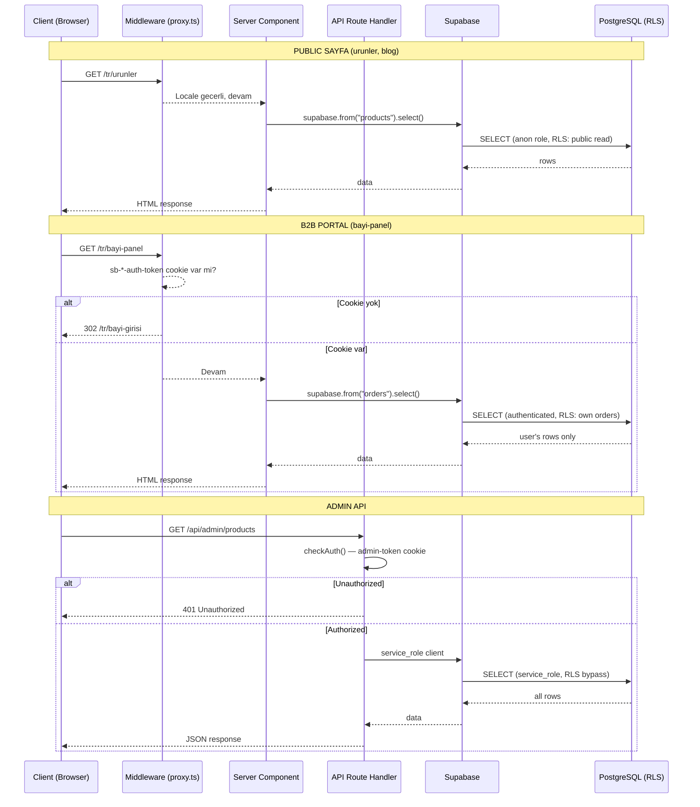
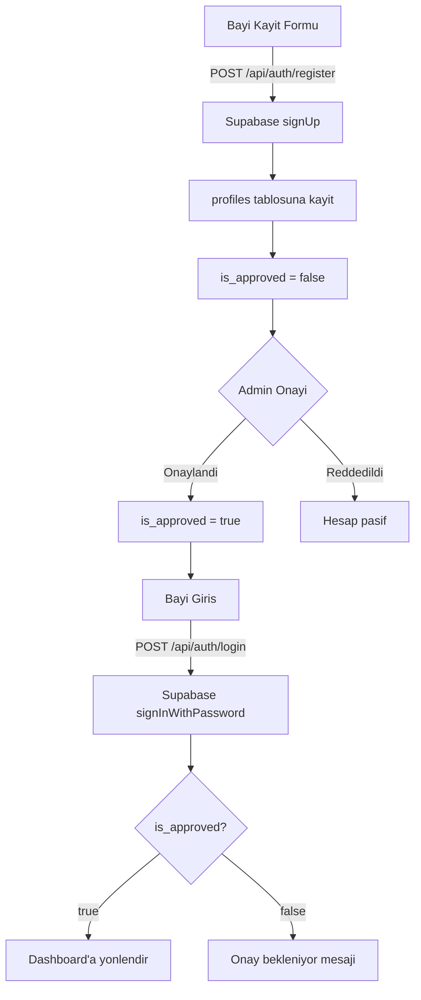

# Mimari

Kismet Plastik B2B platformunun teknik mimarisi.

## Tech Stack

| Katman | Teknoloji |
|--------|-----------|
| Framework | Next.js 16.1.6 (App Router, React 19, Turbopack) |
| Dil | TypeScript 5 (strict mode) |
| Stil | Tailwind CSS 4, CSS custom properties |
| Component | shadcn/ui (new-york style, Radix UI) |
| Veritabani | Supabase (PostgreSQL + RLS) |
| Auth | Supabase Auth (bayi) + cookie-based (admin) |
| E-posta | Resend |
| 3D | Three.js / React Three Fiber + Drei |
| Animasyon | Framer Motion |
| Deploy | Vercel (fra1) + Android TWA |

---

## Route Yapisi

```
src/app/
  [locale]/                        # i18n (tr/en)
    page.tsx                        # Ana sayfa
    urunler/                        # Urun katalogu (public)
    urunler/[category]/[slug]/      # Urun detay + 3D viewer
    hakkimizda/, iletisim/, kalite/ # Kurumsal sayfalar
    blog/, galeri/, sss/            # Icerik sayfalari
    teklif-al/, numune-talep/       # Form sayfalari
    urun-olustur/                   # 2D/3D tasarim araci
    bayi-girisi/                    # Bayi login
    bayi-kayit/                     # Bayi kayit
    bayi-panel/                     # B2B PORTAL (auth zorunlu)
      layout.tsx                    # Sidebar navigasyon
      page.tsx                      # Dashboard
      siparislerim/                 # Siparis yonetimi
      tekliflerim/                  # Teklif yonetimi
      profilim/                     # Profil yonetimi
      urunler/                      # Portal urun listesi

  admin/                            # ADMIN PANEL (cookie auth)
    login/                          # Admin giris
    products/                       # Urun CRUD
    blog/                           # Blog CRUD
    gallery/                        # Galeri yonetimi

  api/                              # API ROUTE'LARI
    auth/login, auth/register       # Bayi auth
    admin/auth, admin/products, admin/blog  # Admin API
    orders/, orders/[id]/           # Siparis API
    quotes/, quote/                 # Teklif API
    contact/, gallery/, chat/       # Diger API'ler
```

---

## Middleware

Middleware `src/proxy.ts` dosyasinda tanimlidir. Uc gorev yapar:

### 1. Locale Routing
URL'de locale yoksa varsayilan locale'e (`/tr`) yonlendirir:
```
/urunler → 301 → /tr/urunler
/blog    → 301 → /tr/blog
```

### 2. Admin Korumasi
`/admin/*` route'lari (login haric) `admin-token` cookie'si ile korunur:
```
/admin/products → admin-token cookie yok → 302 → /admin/login
```
Token dogrulamasi `timingSafeCompare()` ile yapilir (timing attack korunmasi).

### 3. Bayi Panel Korumasi
`/[locale]/bayi-panel/*` route'lari Supabase Auth cookie'si gerektirir:
```
/tr/bayi-panel → sb-*-auth-token yok → 302 → /tr/bayi-girisi
```

**Matcher (haric tutulanlar):** `/api`, `/_next`, `/favicon.ico`, `/images`, `/fonts`, statik dosyalar.

---

## Veri Akisi



---

## Auth Mimarisi

Sistemde iki bagimsiz auth mekanizmasi vardir:

### 1. Admin Auth (Cookie-based)

```
Admin Login → POST /api/admin/auth → sifre kontrolu → admin-token cookie set
```

- `ADMIN_SECRET` env degiskeni ile karsilastirilir
- `timingSafeCompare()` kullanilir (timing attack korunmasi)
- Cookie: `httpOnly`, `secure` (production), `sameSite: lax`, 24 saat TTL
- Logout: DELETE `/api/admin/auth` → cookie silinir

### 2. Bayi Auth (Supabase Auth)



**Kayit formu alanlari:** email, sifre, ad soyad, telefon, firma adi, vergi no, vergi dairesi, adres, sehir, ilce

**Rate limit:**
- Login: 5 istek / 5 dakika / IP
- Register: 3 istek / 5 dakika / IP

---

## Component Hiyerarsisi

```
src/components/
  layout/            # Sayfa iskelet component'leri
    Header.tsx       # Ana navigasyon, locale switcher
    Footer.tsx       # Footer, linkler, iletisim bilgileri

  sections/          # Ana sayfa bolum component'leri
    Hero.tsx         # Kahraman alani
    Categories.tsx   # Kategori kartlari
    RecentProducts.tsx
    Stats.tsx
    WhyUs.tsx
    CTA.tsx

  pages/             # Sayfa-bazli client component'ler
    BlogDetail.tsx
    Category.tsx
    ProductDetail.tsx

  ui/                # Tekrar kullanilanlar
    button.tsx       # shadcn/ui (kucuk harf)
    badge.tsx
    input.tsx
    select.tsx
    textarea.tsx
    dialog.tsx
    Card.tsx         # Ozel (PascalCase)
    StatusBadge.tsx
    ProductCard.tsx
    ProductFilter.tsx
    Product3DViewer.tsx   # Three.js 3D gorsellestirici
    ProductViewer.tsx     # SVG 2D gorsellestirici
    ProductSVG.tsx
    LocaleLink.tsx
    SearchModal.tsx

  seo/               # JSON-LD yapisal veri
    ProductJsonLd.tsx
    OrganizationJsonLd.tsx
```

**Kural:** shadcn/ui component'leri kucuk harfle (`button.tsx`), ozel component'ler PascalCase ile (`ProductCard.tsx`) adlandirilir.

---

## Supabase Client Stratejisi

Uc farkli Supabase client vardir, kullanim baglamina gore secilir:

| Client | Dosya | Kullanim | Auth |
|--------|-------|---------|------|
| Singleton | `src/lib/supabase.ts` | Genel amacli, API route'lari | `persistSession: false` |
| Browser SSR | `src/lib/supabase-browser.ts` | Client Component'ler | Cookie-based SSR |
| Server | `src/lib/supabase-server.ts` | Server Component'ler, Server Action'lar | Async cookie handling |

```typescript
// Server Component icinde
const supabase = await createSupabaseServerClient();

// Client Component icinde
const supabase = getSupabaseBrowser();

// API Route icinde
const supabase = getSupabase();
```

---

## i18n (Coklu Dil)

Dictionary-based yaklasim kullanilir (i18next yok):

```
src/locales/
  tr.json       # Turkce ceviriler (varsayilan)
  en.json       # Ingilizce ceviriler
```

**Kullanim:**
```typescript
// Server tarafinda
import { getDictionary } from "@/lib/i18n";
const dict = getDictionary("tr");

// Client tarafinda
import { useLocale } from "@/contexts/LocaleContext";
const { locale, dict, setLocale } = useLocale();
```

**Navigasyon:** `LocaleLink` component'i locale-aware link olusturur:
```tsx
<LocaleLink href="/urunler">Urunler</LocaleLink>
// Render: <a href="/tr/urunler">Urunler</a>
```

---

## Guvenlik

| Onlem | Uygulama |
|-------|----------|
| Timing-safe compare | `timingSafeCompare()` — admin token dogrulama |
| HTML escaping | `escapeHtml()` — e-posta iceriginde XSS onleme |
| Rate limiting | `rateLimit()` — public form endpoint'leri (3-5 req/dk/IP) |
| RLS | Tum tablolarda aktif — kullanicilar sadece kendi verisini gorur |
| Security headers | `next.config.ts` — X-Frame-Options, X-Content-Type-Options |
| Cookie guvenlik | httpOnly, secure (prod), sameSite: lax |
| Input sanitization | `sanitizeSearchInput()` — SQL injection onleme |
| Supabase Auth | Sifre hash, JWT token, session yonetimi |

---

## Performans

| Optimizasyon | Detay |
|-------------|-------|
| Dynamic import | WhatsApp, ScrollToTop, CookieBanner, InstallPrompt lazy yuklenir |
| Gorsel | AVIF/WebP format, responsive boyutlar, `sharp` ile optimizasyon |
| Font | WOFF2, `font-display: swap`, preload |
| Baglanti | Supabase, Google, WhatsApp icin `preconnect` / `dns-prefetch` |
| PWA | Service worker: cache-first (statik), network-first (sayfa) |
| Cache | Statik dosyalar `max-age=31536000, immutable` |
| Dev | Turbopack ile hizli gelistirme |

---

## Ilgili Dokumanlar

- [DATABASE_SCHEMA.md](docs/DATABASE_SCHEMA.md) — Veritabani sema detaylari
- [B2B_PORTAL.md](docs/B2B_PORTAL.md) — B2B portal kullanim kilavuzu
- [VISUALIZER.md](docs/VISUALIZER.md) — 2D/3D gorsellestirici teknik dokumantar
- [CLAUDE.md](CLAUDE.md) — Gelistirici kurallari ve proje standartlari
