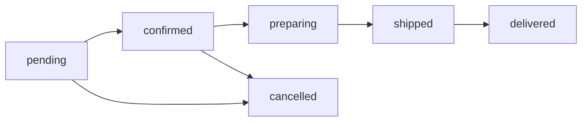

# B2B Bayi Portali

Kismet Plastik B2B bayi portalinin kullanim kilavuzu.

## Genel Bakis

Bayi portali, onaylanmis bayilerin siparis olusturmasini, teklif istemesini ve siparis durumlarini takip etmesini saglayan kapalidevre bir alandir. Portal `/{locale}/bayi-panel` altinda yer alir ve Supabase Auth ile korunur.

---

## Kayit Sureci

### 1. Bayi Kayit Formu

**URL:** `/{locale}/bayi-kayit`
**API:** `POST /api/auth/register`

Kayit formu asagidaki bilgileri ister:

| Alan | Zorunlu | Aciklama |
|------|---------|----------|
| E-posta | Evet | Giris icin kullanilacak |
| Sifre | Evet | Minimum 8 karakter |
| Ad Soyad | Evet | Yetkili kisi adi |
| Telefon | Hayir | Iletisim telefonu |
| Firma Adi | Evet | Ticari unvan |
| Vergi Numarasi | Hayir | Vergi kimlik no |
| Vergi Dairesi | Hayir | Bagli vergi dairesi |
| Adres | Hayir | Firma adresi |
| Sehir | Hayir | Sehir |
| Ilce | Hayir | Ilce |

**Rate limit:** 3 kayit denemesi / 5 dakika / IP

### 2. Onay Sureci

```
Kayit → is_approved = false → Admin Onayi → is_approved = true → Giris Yapilabilir
```

- Kayit sonrasi kullaniciya "Basvurunuz alindi, onay bekleniyor" mesaji gosterilir
- Admin panelinden (`/admin/dealers`) basvurular incelenir ve onaylanir
- Onay sonrasi kullanici e-posta ile bilgilendirilir

### 3. Roller

| Rol | Aciklama | Izinler |
|-----|----------|---------|
| `customer` | Varsayilan rol | Temel erisim |
| `dealer` | Onaylanmis bayi | Portal erisimi, siparis, teklif |
| `admin` | Yonetici | Tam yetki |

---

## Giris

**URL:** `/{locale}/bayi-girisi`
**API:** `POST /api/auth/login`

### Giris Akisi

1. E-posta ve sifre girilir
2. Supabase Auth ile dogrulama yapilir
3. Profil tablosundan `is_approved` kontrolu yapilir
4. Onaylanmis ise `bayi-panel` dashboard'una yonlendirilir
5. Onaylanmamis ise "Hesabiniz onay bekliyor" mesaji gosterilir

**Rate limit:** 5 giris denemesi / 5 dakika / IP

### Login Sayfasi Ozellikleri

- E-posta / sifre formu
- Sifre goster/gizle toggle
- "Beni hatirla" secenegi
- "Sifremi unuttum" linki
- B2B avantajlari bilgi paneli (%30 indirim, %100 destek, 7/24 hizmet)

---

## Dashboard

**URL:** `/{locale}/bayi-panel`
**Dosya:** `src/app/[locale]/bayi-panel/page.tsx`

Dashboard asagidaki istatistik kartlarini gosterir:

| Kart | Veri Kaynagi | Aciklama |
|------|-------------|----------|
| Aktif Siparisler | `orders` (status != delivered/cancelled) | Devam eden siparis sayisi |
| Bekleyen Teklifler | `quote_requests` (status = pending) | Cevaplanmayi bekleyen teklifler |
| Toplam Siparisler | `orders` (tumu) | Toplam siparis sayisi |
| Toplam Urunler | `products` (tumu) | Katalogdaki urun sayisi |

### Hizli Aksiyonlar

- **Urunleri Gor** → `/{locale}/bayi-panel/urunler`
- **Teklif Iste** → `/{locale}/bayi-panel/tekliflerim`
- **Siparislerim** → `/{locale}/bayi-panel/siparislerim`
- **Profilim** → `/{locale}/bayi-panel/profilim`

---

## Portal Layout

**Dosya:** `src/app/[locale]/bayi-panel/layout.tsx`

Sidebar navigasyon menu yapisi:

```
┌─────────────────────┬──────────────────────────────┐
│  Kismet Plastik Logo│                              │
│                     │                              │
│  Dashboard          │     Sayfa Icerigi            │
│  Urunler            │                              │
│  Tekliflerim        │                              │
│  Siparislerim       │                              │
│  Profilim           │                              │
│                     │                              │
│  ─────────────      │                              │
│  Cikis Yap         │                              │
└─────────────────────┴──────────────────────────────┘
```

- Responsive: mobilde hamburger menu ile acilir/kapanir
- Aktif sayfa vurgulanir
- Turkce/Ingilizce dil destegi
- Cikis yapildiginda Supabase `signOut()` cagirilir ve giris sayfasina yonlendirilir

---

## Siparis Yonetimi

**URL:** `/{locale}/bayi-panel/siparislerim`

### Siparis Durumlari



| Durum | Turkce | Renk | Aciklama |
|-------|--------|------|----------|
| `pending` | Beklemede | Sari | Siparis olusturuldu, onay bekleniyor |
| `confirmed` | Onaylandi | Mavi | Admin tarafindan onaylandi |
| `preparing` | Hazirlaniyor | Turuncu | Uretimde |
| `shipped` | Kargoda | Mor | Kargolanmis, takip numarasi mevcut |
| `delivered` | Teslim Edildi | Yesil | Musteri teslim aldi |
| `cancelled` | Iptal | Kirmizi | Iptal edilmis |

### Siparis Olusturma

Yeni siparis icin kullanici su adimlari izler:

1. **Urun secimi:** Katalogdan urun secer, miktar belirler
2. **Adres bilgileri:** Teslimat ve fatura adresi girer
3. **Notlar:** Ozel istekler ve notlar ekler
4. **Onay:** Siparis ozetini inceler ve onaylar

Siparis numarasi otomatik olusturulur: `KP-YYYY-NNNNN` (ornek: `KP-2026-00001`)

---

## Teklif Yonetimi

**URL:** `/{locale}/bayi-panel/tekliflerim`

### Teklif Isteme

1. Firma bilgileri otomatik doldurulur (profilden)
2. Istenen urunler eklenir (urun adi, miktar, notlar)
3. Ek mesaj yazilir
4. Teklif gonderilir

### Teklif Durumlari

| Durum | Turkce | Aciklama |
|-------|--------|----------|
| `pending` | Beklemede | Henuz incelenmedi |
| `reviewed` | Incelendi | Satis ekibi inceledi |
| `replied` | Cevaplandi | Fiyat teklifi gonderildi |
| `closed` | Kapandi | Kabul/ret sonrasi |

---

## Profil Yonetimi

**URL:** `/{locale}/bayi-panel/profilim`

Kullanici kendi profil bilgilerini guncelleyebilir:

- Ad soyad
- Telefon
- Firma bilgileri (ad, adres, vergi no)
- Sifre degistirme

> **Not:** E-posta ve rol degisikligi admin onay gerektirir.

---

## API Endpoint Referansi

### Auth

| Endpoint | Method | Auth | Aciklama |
|----------|--------|------|----------|
| `/api/auth/login` | POST | Hayir | Bayi girisi |
| `/api/auth/register` | POST | Hayir | Bayi kayit |

### Siparis

| Endpoint | Method | Auth | Aciklama |
|----------|--------|------|----------|
| `/api/orders` | GET | Evet | Kullanicinin siparislerini listele |
| `/api/orders` | POST | Evet | Yeni siparis olustur |
| `/api/orders/[id]` | GET | Evet | Siparis detayi |
| `/api/orders/[id]` | PATCH | Evet | Siparis guncelle |

### Teklif

| Endpoint | Method | Auth | Aciklama |
|----------|--------|------|----------|
| `/api/quotes` | GET | Evet | Kullanicinin tekliflerini listele |
| `/api/quotes` | POST | Evet | Yeni teklif olustur |
| `/api/quote` | POST | Hayir | Public teklif formu |

### Ortak Response Formati

```json
{
  "success": true,
  "data": { ... },
  "message": "Islem basarili"
}
```

```json
{
  "success": false,
  "error": "Hata mesaji"
}
```

---

## Ilgili Dokumanlar

- [DATABASE_SCHEMA.md](DATABASE_SCHEMA.md) — Veritabani sema detaylari
- [ARCHITECTURE.md](../ARCHITECTURE.md) — Genel mimari
- [VISUALIZER.md](VISUALIZER.md) — 2D/3D gorsellestirici
