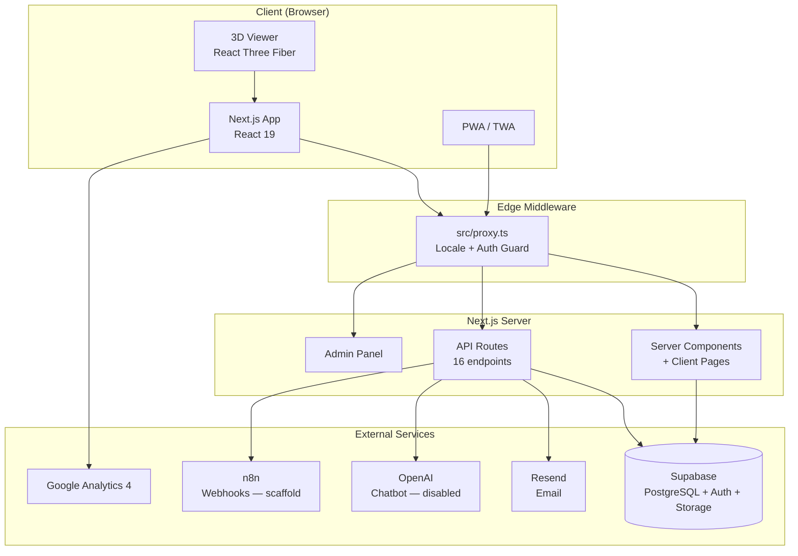
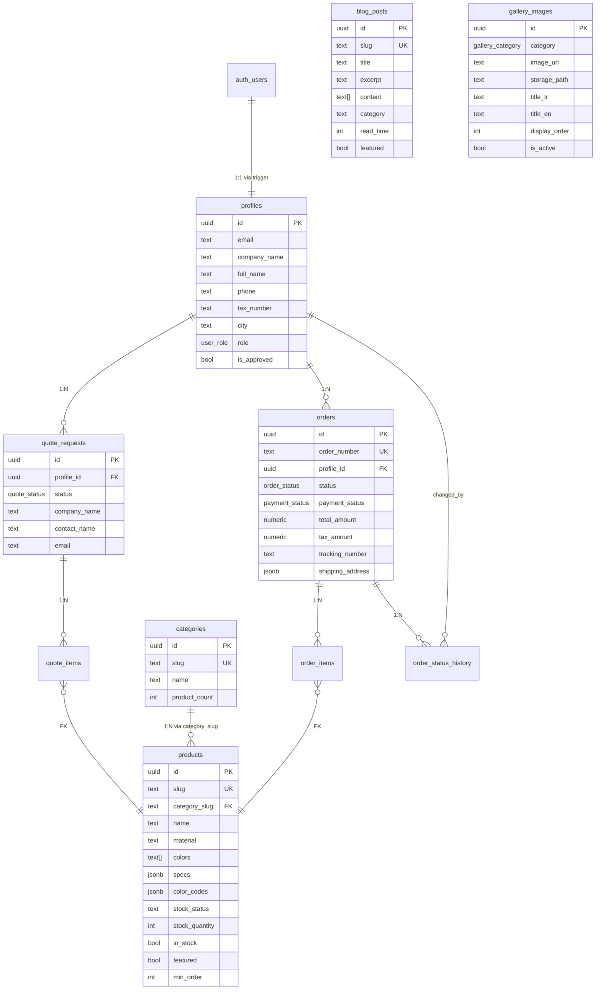
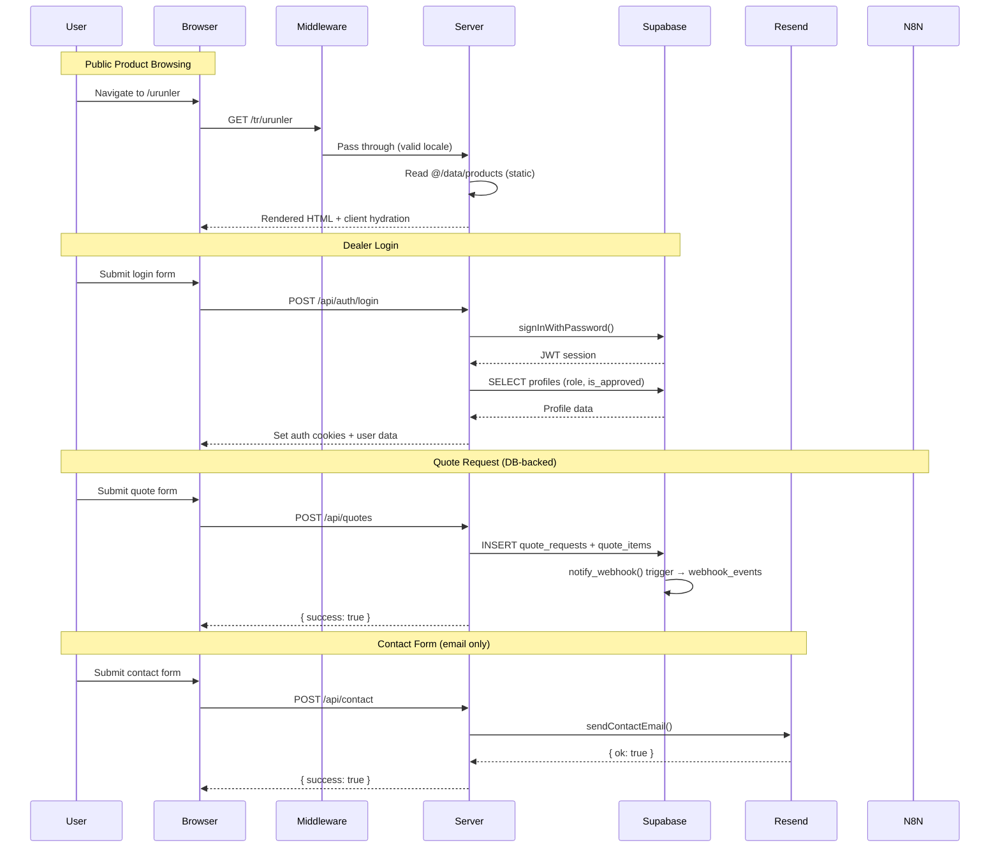

# Codebase Map — Kısmet Plastik B2B Web App

> Auto-generated by Cartographer. Last mapped: 2026-03-04

## System Overview



## Directory Structure

```
kismetplastik-new/
├── docs/                          # SQL migrations + n8n workflow definitions
│   ├── supabase-schema.sql        # Core: categories, products, blog_posts
│   ├── supabase-migration-002.sql # B2B: profiles, orders, quotes, contact_messages
│   ├── supabase-migration-003.sql # Gallery system + storage bucket
│   ├── supabase-migration-004.sql # Sample requests
│   ├── supabase-migrations/
│   │   ├── 005_lead_downloads.sql # Lead capture for resource downloads
│   │   ├── 006_stock_preorder.sql # Stock columns + pre_orders table
│   │   ├── 007_chat_sessions.sql  # AI chatbot session persistence
│   │   └── 008_webhook_triggers.sql # webhook_events + DB triggers
│   └── n8n/                       # n8n workflow JSON definitions
│       └── workflows/             # 7 notification workflow templates
├── public/                        # Static assets
│   ├── fonts/                     # Myriad Pro (woff2 + otf)
│   ├── sertifikalar/              # ISO certificate PDFs
│   ├── .well-known/               # Android TWA asset links
│   ├── manifest.json              # PWA manifest
│   └── sw.js                      # Service worker (cache-first static, network-first pages)
├── scripts/
│   └── import-data.mjs            # Supabase seed script
├── src/
│   ├── app/
│   │   ├── layout.tsx             # Root layout (minimal — just imports globals.css)
│   │   ├── globals.css            # Design tokens, fonts, dark mode, Tailwind v4 theme
│   │   ├── sitemap.ts             # Dynamic sitemap (11 locales × all routes)
│   │   ├── robots.ts              # Robots.txt (disallow /admin/, /api/)
│   │   ├── [locale]/              # 30+ locale-scoped pages (11 locales)
│   │   ├── admin/                 # Admin panel (products, blog, gallery, dealers)
│   │   └── api/                   # 16 API route files
│   ├── components/
│   │   ├── analytics/             # GoogleAnalytics (GA4 + consent mode)
│   │   ├── layout/                # Header (mega-menu + mobile), Footer
│   │   ├── sections/              # 9 homepage sections (Hero → CTA)
│   │   ├── pages/                 # 10 client-side page delegates
│   │   ├── seo/                   # JSON-LD structured data (5 schema types)
│   │   └── ui/                    # 37+ UI components (shadcn/ui + custom)
│   ├── contexts/                  # ThemeContext, LocaleContext
│   ├── data/                      # 7 static data modules
│   ├── hooks/                     # 4 hooks (recentProducts, scrollAnimation, analytics, quoteCart)
│   ├── lib/                       # 15+ utility modules
│   │   ├── locales.ts             # NEW: Single source of truth for locale config
│   │   ├── supabase/              # Canonical Supabase clients (client, server, admin)
│   │   ├── supabase.ts            # Legacy singleton (no session)
│   │   ├── supabase-browser.ts    # DEPRECATED shim → supabase/client.ts
│   │   └── supabase-server.ts     # DEPRECATED shim → supabase/server.ts
│   ├── locales/                   # 11 translation JSON files
│   ├── store/                     # Zustand: useCompareStore (product comparison)
│   └── types/                     # TypeScript definitions (database, product, gtag)
├── twa/                           # Android TWA Bubblewrap config
├── next.config.ts                 # Security headers, image optimization
├── tsconfig.json                  # Strict mode, @/* alias, ES2022
└── components.json                # shadcn/ui config (new-york style)
```

## Module Guide

### 1. Middleware — `src/proxy.ts`

**Purpose:** Edge middleware for locale routing, admin auth guard, and dealer portal auth guard.

**Flow:**
```
Request → /admin/* (not /login) → check admin-token cookie → redirect to /admin/login if invalid
Request → /[locale]/bayi-panel/* → check Supabase sb-* cookie → redirect to /bayi-girisi if missing
Request → no locale prefix → redirect to /tr/[path]
Request → valid locale path → pass through
```

**Supported locales:** `tr, en, ar, ru, fr, de, es, zh, ja, ko, pt` (11 total) — sourced from `@/lib/locales`

**Matcher:** Excludes files with extensions, `_next/static`, `_next/image`, `favicon.ico`, and API routes.

---

### 2. Locale System — `src/lib/locales.ts` + `src/lib/i18n.ts`

**`locales.ts`** (NEW — single source of truth):
- `locales` tuple: `["tr","en","ar","ru","fr","de","es","zh","ja","ko","pt"]`
- `Locale` type, `defaultLocale: "tr"`, `localeNames`, `localeDirections` (only `ar: "rtl"`)
- Zero dependencies, safe for all runtimes (Edge, server, client)

**`i18n.ts`**:
- `getDictionary(locale)` → returns typed translation object, falls back to `tr`
- All 11 locale JSON files eagerly imported (no code splitting per locale)
- Re-exports `allLocales`, `localeNames`, `localeDirections`, `Locale` from `locales.ts`

**Gotchas:**
- All translation strings are bundled client-side for all 11 locales
- Dictionary type inferred from `tr.json` — all locale files must match this shape
- `proxy.ts` and `i18n.ts` now share locale definitions via `locales.ts` (previously duplicated)

---

### 3. Core Lib — `src/lib/`

| File | Purpose | Key Exports |
|------|---------|-------------|
| `locales.ts` | Locale config (SSOT) | `locales`, `Locale`, `defaultLocale`, `localeNames`, `localeDirections` |
| `auth.ts` | Admin auth + timing-safe compare | `timingSafeCompare()`, `checkAuth()`, `sanitizeSearchInput()` |
| `email.ts` | Resend email service | `sendContactEmail()`, `sendQuoteEmail()` |
| `rate-limit.ts` | In-memory rate limiter (process-local) | `rateLimit(key, options)` |
| `i18n.ts` | Dictionary-based i18n (11 locales) | `getDictionary()`, `allLocales`, `Locale` type |
| `utils.ts` | Tailwind class merger | `cn()` |
| `constants.ts` | Business constants | `FOUNDING_YEAR`, `CURRENT_YEAR`, `YEARS_OF_EXPERIENCE` |
| `ical.ts` | iCal file generator (RFC 5545) | `generateICalEvent()`, `downloadICalEvent()` |
| `chat-system-prompt.ts` | AI chatbot persona (TR/EN only) | `getSystemPrompt(locale)` |
| `webhook.ts` | n8n webhook dispatch + HMAC verify | `sendWebhookEvent()`, `verifyHmacSignature()` |

**Supabase clients (4 variants):**

| File | Context | Auth | Use When |
|------|---------|------|----------|
| `supabase.ts` | General singleton | No session | Public data reads, admin GET routes |
| `supabase/client.ts` | Browser | Cookie session | Client Components with auth |
| `supabase/server.ts` | SSR server | Async cookies | Route Handlers, Server Components with auth |
| `supabase/admin.ts` | Admin (service role) | Bypasses RLS | Admin write operations only |
| `supabase-browser.ts` | **DEPRECATED** shim | → `supabase/client.ts` | Legacy imports only |
| `supabase-server.ts` | **DEPRECATED** shim | → `supabase/server.ts` | Legacy imports only |

---

### 4. API Routes — `src/app/api/`

#### Public Endpoints (no auth required)

| Route | Methods | Purpose | Rate Limit | DB Tables |
|-------|---------|---------|------------|-----------|
| `/api/contact` | POST | Contact form → email via Resend | 5/min | None (email only) |
| `/api/quote` | POST | Quote request → email via Resend | 3/min | None (email only) |
| `/api/quotes` | POST | Structured quote → Supabase DB | 3/min | `quote_requests`, `quote_items` |
| `/api/gallery` | GET | List active gallery images | None | `gallery_images` |
| `/api/auth/login` | POST | Dealer login via Supabase Auth | 5/5min | `profiles` (read) |
| `/api/auth/register` | POST | Dealer registration (pending approval) | 3/5min | `profiles` (update) |

#### Authenticated Dealer Endpoints

| Route | Methods | Purpose | Auth |
|-------|---------|---------|------|
| `/api/orders` | POST | Create new order | Supabase session (JWT) |

#### Admin Endpoints (require `admin-token` cookie)

| Route | Methods | Purpose |
|-------|---------|---------|
| `/api/admin/auth` | POST, DELETE | Admin login/logout |
| `/api/admin/products` | GET, POST | Product CRUD (static fallback if no Supabase) |
| `/api/admin/products/[id]` | GET, PUT, DELETE | Single product management |
| `/api/admin/blog` | GET, POST | Blog post CRUD |
| `/api/admin/blog/[slug]` | GET, PUT, DELETE | Single blog post management |
| `/api/gallery` | POST | Gallery image upload (admin) |
| `/api/gallery/[id]` | PATCH, DELETE | Gallery image management |
| `/api/orders` | GET | Order listing with pagination |
| `/api/orders/[id]` | GET, PATCH | Order detail + status updates |
| `/api/quotes` | GET | Quote request listing with pagination |

#### Webhook Endpoint

| Route | Methods | Purpose | Auth |
|-------|---------|---------|------|
| `/api/webhooks/n8n` | POST | Inbound webhook from n8n | HMAC-SHA256 signature |

**Response patterns (two coexist):**
- Modern B2B routes: `{ success: true/false, data?, error?, message?, pagination? }`
- Admin CRUD routes: `{ product/post/products/posts, source?, error? }` (older pattern)

---

### 5. Pages — `src/app/[locale]/`

#### Fully Implemented Public Pages

| Route | Type | Data Source |
|-------|------|-------------|
| `/` | Server | Sections pull from static data + locale dict |
| `/urunler` | Client | `@/data/products` (client-side filtering) |
| `/urunler/[category]` | Server → `CategoryClient` | `@/data/products` |
| `/urunler/[category]/[slug]` | Server → `ProductDetailClient` | `@/data/products` |
| `/blog` | Client | `@/data/blog` |
| `/blog/[slug]` | Server → `BlogDetailClient` | `@/data/blog` |
| `/hakkimizda` | Client | Locale dict |
| `/iletisim` | Client | Locale dict, POST `/api/contact` |
| `/kalite` | Client | Locale dict + hardcoded cert data |
| `/kariyer` | Client | Locale dict + hardcoded job data |
| `/uretim` | Client | Locale dict + hardcoded facility data |
| `/sss` | Client | Locale dict + hardcoded FAQ data |
| `/teklif-al` | Client | Locale dict, `@/data/products` categories, POST `/api/quote` |
| `/bayi-girisi` | Client | Locale dict, POST `/api/auth/login` |
| `/referanslar` | Client | `@/data/references` via `ReferenceLogos` |
| `/tarihce` | Server | `@/data/milestones` |

#### Delegating Wrapper Pages (Server → Client component)

| Route | Client Component | Status |
|-------|-----------------|--------|
| `/fuarlar` | `TradeShowsClient` | Implemented |
| `/numune-talep` | `SampleRequestClient` | Implemented |
| `/sertifikalar` | `CertificatesClient` | Implemented |
| `/fabrika` | `FactoryClient` | Implemented |
| `/karsilastir` | `CompareClient` | Implemented |
| `/kaynaklar` | `ResourcesClient` | Implemented |
| `/on-siparis` | `PreOrderClient` | Implemented |

#### Dealer Portal (Supabase Auth required)

| Route | Status | Data Source |
|-------|--------|-------------|
| `/bayi-panel` | Dashboard implemented | Supabase (live counts) |
| `/bayi-panel/profilim` | **Stub** | — |
| `/bayi-panel/siparislerim` | **Stub** | — |
| `/bayi-panel/tekliflerim` | **Stub** | — |
| `/bayi-panel/urunler` | **Stub** | — |

#### Stub Pages (route exists, no content)

`ambalaj-sozlugu`, `arge`, `galeri`, `kvkk`, `sektorler`, `surdurulebilirlik`, `urun-olustur`, `vizyon-misyon`, `bayi-kayit`

#### Partially Implemented

| Route | Issue |
|-------|-------|
| `/katalog` | Download feature shows placeholder alert |

#### Admin Panel (`/admin/*` — cookie auth)

| Route | Type | Status |
|-------|------|--------|
| `/admin` | Server | Fully implemented (dashboard with stats) |
| `/admin/login` | Client | Fully implemented |
| `/admin/products` | Client | Implemented (delete button UI-only) |
| `/admin/products/new` | Client | Fully implemented |
| `/admin/products/[id]` | Client | Fully implemented |
| `/admin/blog` | Client | Partial (uses local data copy, delete unwired) |
| `/admin/blog/new` | Client | Fully implemented |
| `/admin/blog/[slug]` | Client | Partial (1 demo post, delete unwired) |
| `/admin/gallery` | Server | **Stub** |
| `/admin/content` | Server | **Stub** |
| `/admin/dealers` | Server | **Stub** |

---

### 6. Components — `src/components/`

#### Layout (2)

| Component | Type | Key Feature |
|-----------|------|-------------|
| `Header` | Client | Sticky mega-menu, mobile Sheet, Ctrl+K search, theme/locale toggle, 4 dropdown categories |
| `Footer` | Client | 4-column dark footer, newsletter (client-side only), social links |

#### Homepage Sections (9)

| Component | Key Feature |
|-----------|-------------|
| `Hero` | Rotating headline words (3-word cycle), floating glassmorphism stat cards, particle dots, SVG rings |
| `Categories` | 8 category cards with custom SVG icons, staggered AnimateOnScroll |
| `About` | Logo visual + strength checklist, directional scroll animations |
| `Stats` | 4 animated counters via requestAnimationFrame + IntersectionObserver, Phosphor duotone icons |
| `RecentProducts` | localStorage-based recently viewed strip, horizontal snap scroll, conditional render |
| `Sectors` | 6-sector bento grid with react-icons/fa6, hover gradient sweeps |
| `Testimonials` | 3-column cards + infinite CSS marquee of reference names |
| `WhyUs` | 6 features with SVG dashed connectors, alternating color schemes |
| `CTA` | Shimmer border animation + 3 ISO trust badges + dual CTAs |

#### Page Client Components (10)

| Component | Key Feature |
|-----------|-------------|
| `ProductDetailClient` | 2D/3D viewer toggle (React.lazy), color picker, specs table, sticky quote bar, JSON-LD |
| `CategoryClient` | Search + sort + `CompareBar`, Turkish locale sort |
| `BlogDetailClient` | Static post render + related posts sticky sidebar |
| `CompareClient` | Side-by-side comparison (Zustand, max 3), diff highlighting |
| `FactoryClient` | Video placeholder + photo gallery with `ImageLightbox`, Framer Motion |
| `TradeShowsClient` | iCal download, upcoming/past split, locale-aware dates |
| `CertificatesClient` | Certificate cards + Organization JSON-LD, PDF downloads |
| `ResourcesClient` | Lead capture modal before download, category color theming |
| `SampleRequestClient` | 3-step Zod-validated wizard, multi-select product categories |
| `PreOrderClient` | Pre-order form with Zod validation, sticky benefits sidebar |

#### Custom UI Components (25+)

| Component | Purpose |
|-----------|---------|
| `AnimateOnScroll` | IntersectionObserver scroll-reveal (6 animation types, pure CSS) |
| `ProductCard` | Product grid card with compare toggle, category-colored SVG patterns, `memo()` |
| `Product3DViewer` | **React.lazy** Three.js 3D viewer (5 model types), orbit controls, fullscreen |
| `ProductViewer` | 2D SVG viewer with Framer Motion color picker, zoom toggle, `memo()` |
| `ProductSVG` | Programmatic SVG illustrations (6 form factors), exports `colorMap` |
| `ProductFilter` | Sidebar/top-bar filter panel (search, category, material, sort) |
| `SearchModal` | Full-screen Ctrl+K search (products + categories + 11 pages, max 8 results) |
| `LocaleLink` | Auto locale-prefix `next/link` wrapper (skips /api/ and /#) |
| `StickyQuoteBar` | Fixed-bottom product CTA (appears after 500px scroll, dismissible) |
| `CompareBar` | Fixed-bottom comparison strip (Zustand + Framer Motion spring) |
| `ImageLightbox` | Fullscreen lightbox (keyboard + touch swipe, Framer Motion directional) |
| `AIChatbot` | Floating AI chat with SSE streaming (currently disabled) |
| `WhatsAppButton` | Floating widget (3 agents, quick templates, business hours detection) |
| `CookieBanner` | KVKK consent with GA4 Consent Mode integration (3 categories) |
| `InstallPrompt` | PWA install banner (beforeinstallprompt event, 5s delay) |
| `ScrollToTop` | Fixed scroll-to-top button (appears after 400px) |
| `StockBadge` | Locale-aware stock status indicator (4 states, animated pulse for low_stock) |
| `StatusBadge` | Order status badge (6 states, Turkish labels) |
| `CategoryIcons` | 8 custom SVG product category icons + map/list exports |
| `Timeline` | Alternating left/right milestone timeline with per-card IntersectionObserver |
| `ReferenceLogos` | Compact (infinite marquee) or full (grid) reference logos, grayscale→color hover |
| `YouTubeEmbed` | Privacy-respecting lazy YouTube embed (youtube-nocookie.com, IntersectionObserver) |
| `VideoJsonLd` | VideoObject JSON-LD schema component |
| `Card` | Compound card with `.card-border-gradient` CSS class |
| `PageTransition` | Framer Motion page fade/slide wrapper |

#### shadcn/ui Components (11)

`badge`, `button`, `dialog`, `dropdown-menu`, `input`, `label`, `navigation-menu`, `select`, `sheet`, `sonner`, `textarea`

#### Dynamically Imported (deferred loading in root layout)

`WhatsAppButton`, `ScrollToTop`, `CookieBanner`, `InstallPrompt`, `GoogleAnalytics`

#### Lazy Loaded (React.lazy)

`Product3DViewer` (loaded in `ProductDetailClient`)

---

### 7. Data Layer — `src/data/`

| File | Records | Purpose | Consumed By |
|------|---------|---------|-------------|
| `products.ts` | 8 categories, 23 products | Product catalog (primary data source) | Product pages, admin panel, API fallback, SearchModal |
| `blog.ts` | 6 posts | Industry blog content | Blog pages, admin panel |
| `certificates.ts` | 6 certificates | ISO/quality certs with PDF links | `/kalite` page |
| `milestones.ts` | 8 milestones (1969–2026) | Company history timeline | `/tarihce` page |
| `trade-shows.ts` | 3 shows | Trade fair schedule (manual status) | `/fuarlar` page |
| `resources.ts` | 4 resources | Downloadable technical documents | `/katalog`, `/kaynaklar` pages |
| `references.ts` | 8 references | Customer reference logos | `ReferenceLogos` component |

**Note:** Category `productCount` values in `products.ts` don't match actual product counts — they represent target catalog sizes.

---

### 8. State Management

| Store/Context | Type | Purpose | Persistence |
|---------------|------|---------|-------------|
| `LocaleContext` | React Context | Locale + dictionary | URL (source of truth) |
| `ThemeContext` | React Context | Light/dark theme | localStorage (`kismet-theme`) |
| `useCompareStore` | Zustand + persist | Product comparison (max 3) | localStorage (`kismet-compare`) |
| `useRecentProducts` | Hook | Recently viewed products (max 8) | localStorage |

---

### 9. Database Schema



**Standalone tables:** `contact_messages`, `catalog_downloads`, `sample_requests`, `lead_downloads`, `pre_orders`, `chat_sessions`, `webhook_events`

**Key triggers:**
- `handle_new_user()` — auto-creates `profiles` row on auth signup (SECURITY DEFINER)
- `generate_order_number()` — generates `KP-YYMM-NNNN` format on orders INSERT
- `notify_webhook()` — logs new orders/quotes/samples/pre-orders to `webhook_events`
- `update_updated_at()` — auto-updates timestamp on products, blog_posts, profiles

**Enums:** `user_role` (admin/dealer/customer), `quote_status`, `order_status`, `payment_status`, `gallery_category` (uretim/urunler/etkinlikler)

---

## Data Flow



## Authentication Architecture

Two independent auth systems:

| System | Mechanism | Guard Location | Cookie |
|--------|-----------|----------------|--------|
| **Admin** | Password → `admin-token` cookie vs `ADMIN_SECRET` | `proxy.ts` (middleware) + `checkAuth()` (API routes) | `admin-token` (httpOnly, secure, 24h) |
| **Dealer** | Email/password → Supabase Auth JWT | `proxy.ts` (cookie presence check) + client-side `auth.getUser()` | `sb-*-auth-token` (managed by @supabase/ssr) |

**Security notes:**
- Admin cookie value IS the secret itself (not a derived token)
- Admin login endpoint (`/api/admin/auth`) has NO rate limiting
- Dealer registration creates user in pending state (`is_approved: false`), login rejected for unapproved dealers
- Non-dealer users (role "customer") bypass approval check

---

## n8n Webhook Integration

Three independent layers (not yet wired together):

### Outbound: App → n8n (`src/lib/webhook.ts`)
- `sendWebhookEvent(event, data)` → POST to `N8N_WEBHOOK_URL` with HMAC-SHA256 signature
- Fire-and-forget (errors logged, not rethrown)

### Inbound: n8n → App (`/api/webhooks/n8n`)
- Validates `x-webhook-signature` header
- 7 event types supported: `new_order`, `new_quote`, `new_contact`, `new_sample_request`, `new_pre_order`, `stock_alert`, `new_lead`
- **All handlers are scaffold** — only `console.log`, no business logic

### DB-Level Event Log (Migration 008)
- Triggers on `orders`, `quote_requests`, `sample_requests`, `pre_orders` INSERT
- Logs to `webhook_events` table with `status: "pending"`

---

## Conventions

### File Naming
- Pages: kebab-case Turkish slugs (`bayi-girisi`, `teklif-al`)
- Components: PascalCase custom (`ProductCard.tsx`), lowercase shadcn (`button.tsx`)
- Lib: kebab-case (`rate-limit.ts`, `supabase-server.ts`)

### Component Patterns
- Server Components by default; `"use client"` only when needed
- Page-level pattern: thin Server Component (metadata) → delegates to Client Component (rendering)
- `AnimateOnScroll` for scroll reveals (pure CSS transitions, no Framer Motion)
- `LocaleLink` for all internal navigation (auto locale prefix)
- `cn()` for conditional Tailwind class merging
- `React.memo` on heavy list items (`ProductCard`, `ProductViewer`)
- Hydration guard (`mounted` state) for Zustand-persisted stores (`CompareBar`, `CompareClient`)

### i18n Pattern
- `useLocale()` → `{ locale, setLocale, dict }` — client components
- `getDictionary(locale)` — server components (direct import)
- Some components use inline `t = { tr: {...}, en: {...} }` for self-contained text
- `Dictionary` type inferred from `tr.json` — all locale files must match this shape

### API Conventions
- Modern routes: `{ success: true/false, error?, message?, data?, pagination? }`
- Admin CRUD routes: `{ products/product, source?, error? }` (older pattern, not normalized)
- Rate limit public endpoints via `rateLimit(key, { limit, windowMs })`
- HTML-escape user input before email inclusion
- Admin routes: `checkAuth()` guard returning 401 JSON
- Static data fallback: admin product GETs work without Supabase (`source: "static"`)

### Styling
- Tailwind CSS 4 with CSS custom properties in `globals.css`
- Two brand systems coexist:
  - Original: `--primary-*` (blues) / `--accent-*` (gold)
  - Target B2B: `--color-navy-*` / `--color-amber-*` / `--color-cream-*`
- Dark mode: `.dark` class + `data-theme="dark"` on `<html>`
- Fonts loaded: Myriad Pro (woff2 `@font-face`), Fraunces + Instrument Sans (Google Fonts via `next/font`)
- Respects `prefers-reduced-motion` in Timeline and animation components

---

## Gotchas

1. **Duplicate Supabase clients** — `supabase-browser.ts` and `supabase-server.ts` (flat) are deprecated shims. Prefer `supabase/client.ts` and `supabase/server.ts`.

2. **Rate limiter is process-local** — In-memory Map resets on cold start; not shared across Vercel serverless instances.

3. **Admin login has no rate limiting** — `/api/admin/auth` endpoint can be brute-forced.

4. **Admin cookie stores the actual secret** — The `admin-token` cookie value equals `ADMIN_SECRET`, not a derived token.

5. **Order price not server-validated** — `POST /api/orders` accepts `unit_price` from client payload without verification.

6. **Data source mismatch** — Most pages read from static `@/data/` files. Supabase is only actively queried by the dealer portal dashboard. Admin panel also reads from static data.

7. **Blog data duplication** — Admin blog page has inline hardcoded posts AND `@/data/blog.ts` has separate posts. Not wired together.

8. **Database types hand-authored** — `src/types/database.ts` is not generated by `supabase gen types` and can drift from actual schema. Missing types for `gallery_images`, `sample_requests`, `lead_downloads`, `pre_orders`, `chat_sessions`, `webhook_events`.

9. **Two API response patterns** — Admin CRUD routes use `{ product, source }` while B2B routes use `{ success, data }`. Not normalized.

10. **n8n integration is scaffold** — Inbound webhook handlers only `console.log`. DB triggers, outbound dispatch, and inbound receiver are not wired together.

11. **Turkish character issues in static data** — `milestones.ts`, `trade-shows.ts`, and `resources.ts` use ASCII approximations for Turkish characters (e.g., "Kurulus" instead of "Kuruluş").

12. **TWA not production-ready** — `assetlinks.json` has placeholder SHA256 fingerprint.

13. **RLS policy gaps** — `pre_orders` and `webhook_events` have RLS enabled but no policies defined (blocks all direct access). Gallery API uses service role client, bypassing gallery_images RLS.

14. **All locale translations bundled** — No code splitting per locale; all 11 language JSONs are in every client bundle.

15. **FOUC on theme** — Theme initializes as "light" on server, then `useEffect` applies stored preference. No blocking `<script>` to prevent flash.

---

## Navigation Guide

**To add a new public page:**
1. Create `src/app/[locale]/your-page/page.tsx` (+ optional `layout.tsx` for metadata)
2. Add translation keys to all 11 files in `src/locales/`
3. Update `src/app/sitemap.ts` to include the new route
4. Add navigation entry in `src/components/layout/Header.tsx` (mega-menu or mobile drawer)

**To add a new API endpoint:**
1. Create `src/app/api/your-route/route.ts`
2. Follow pattern: validate input → rate limit (if public) → auth check (if admin/dealer) → Supabase operation → return `{ success, data/error }`
3. Use `getSupabase()` for public reads, `supabaseServer()` for session-aware ops, `supabaseAdmin()` for admin writes

**To add a new product category:**
1. Add entry to `categories` array in `src/data/products.ts`
2. Add SVG icon in `src/components/ui/CategoryIcons.tsx`
3. Update `categoryIconMap` and `categoryIconList` in same file
4. Add category mapping in `Product3DViewer.tsx` (`categoryTo3DModel`)
5. Add category color in `ProductCard.tsx` (`categoryColorMap`)
6. Run `node scripts/import-data.mjs` to sync to Supabase

**To add a new component:**
1. Place in appropriate `src/components/` subdirectory
2. Use `"use client"` only if it needs interactivity
3. Use `useLocale()` for translations, `cn()` for class merging
4. Use `LocaleLink` instead of `next/link` for internal links

**To modify authentication:**
- Admin: `src/proxy.ts` (middleware guard) + `src/lib/auth.ts` (API guard)
- Dealer: `src/app/api/auth/login/route.ts` + `src/app/api/auth/register/route.ts`
- Supabase RLS: SQL files in `docs/`

**To add a new database table:**
1. Write SQL migration in `docs/supabase-migrations/NNN_description.sql`
2. Add TypeScript types to `src/types/database.ts`
3. Create API route if needed

**To add a new locale:**
1. Create `src/locales/{code}.json` (copy `tr.json` and translate)
2. Add to `src/lib/locales.ts` — `locales` tuple, `localeNames`, and `localeDirections` (if RTL)
3. Add import and entry in `src/lib/i18n.ts` `dictionaries` map
4. No other files need changes (sitemap, middleware, locale context all derive from `locales.ts`)

---

## Environment Variables

| Variable | Required | Used By |
|----------|----------|---------|
| `NEXT_PUBLIC_SUPABASE_URL` | Yes | All Supabase clients |
| `NEXT_PUBLIC_SUPABASE_ANON_KEY` | Yes | All Supabase clients |
| `SUPABASE_SERVICE_ROLE_KEY` | For admin ops | `supabase/admin.ts` |
| `ADMIN_SECRET` | Yes | `proxy.ts`, `auth.ts`, `/api/admin/auth` |
| `RESEND_API_KEY` | No | `email.ts` (logs to console without) |
| `EMAIL_FROM` / `EMAIL_TO` | No | `email.ts` (has fallback defaults) |
| `OPENAI_API_KEY` | No | AI chatbot (disabled) |
| `NEXT_PUBLIC_GA_MEASUREMENT_ID` | No | `GoogleAnalytics.tsx` |
| `N8N_WEBHOOK_URL` | No | `webhook.ts` (silent no-op without) |
| `N8N_WEBHOOK_SECRET` | No | `webhook.ts`, `/api/webhooks/n8n` |
