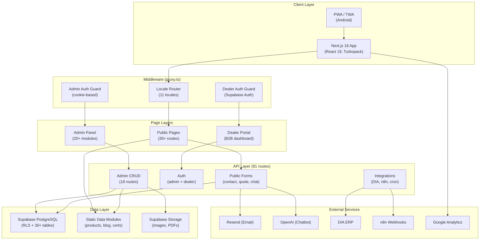
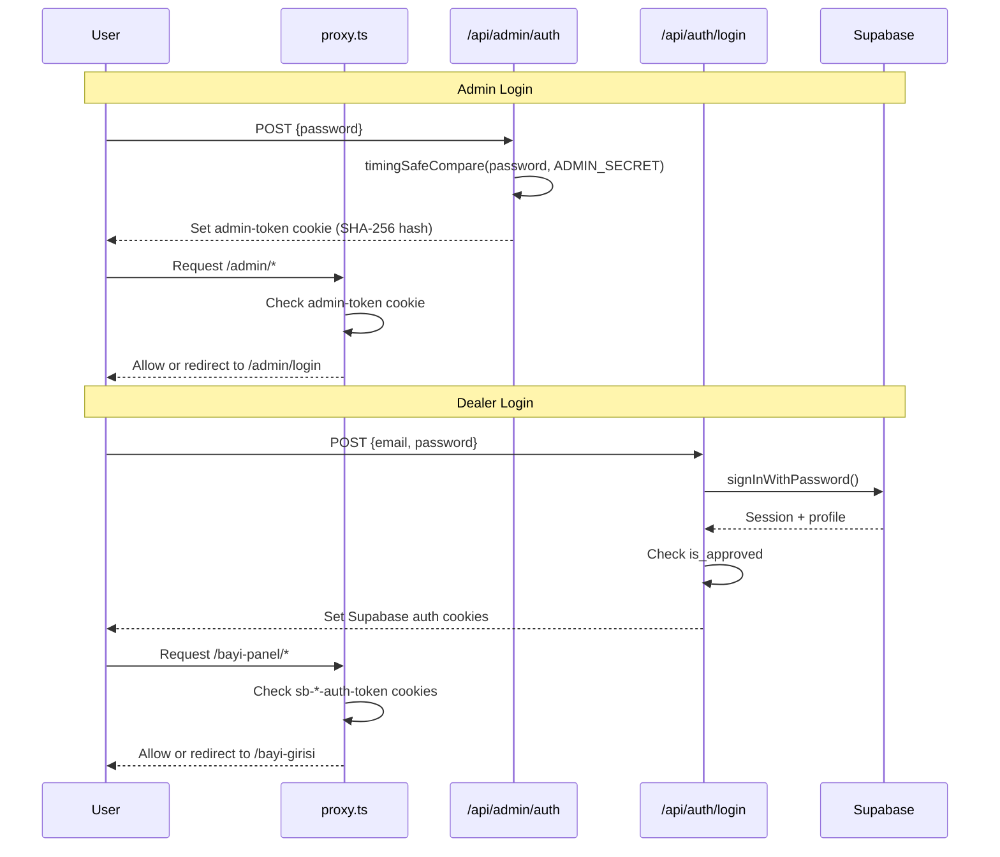
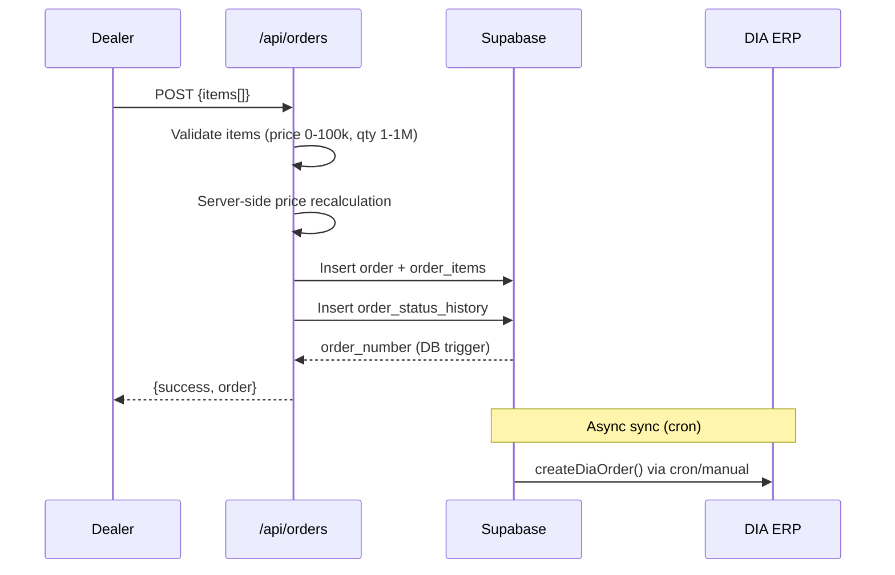
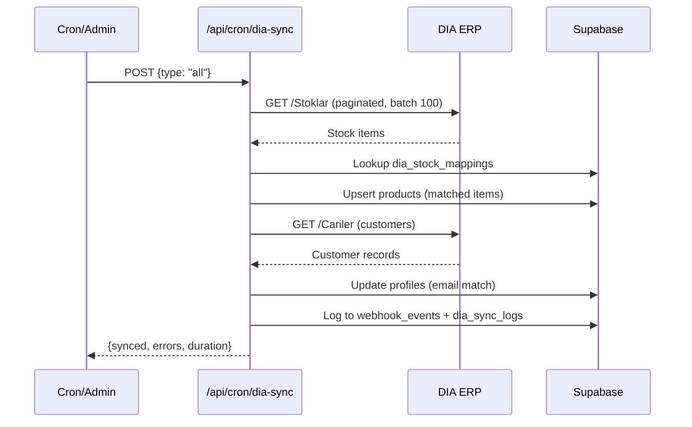

# Codebase Map — Kismet Plastik B2B Web App

> Auto-generated by Cartographer. Last mapped: 2026-03-05T02:56:02Z

## System Overview



## Directory Structure

```
kismetplastik-new/
├── docs/                        # SQL migrations (11 files) + planning docs
├── public/                      # Static assets, fonts, PWA manifest, service worker
├── scripts/                     # Data import/seed scripts
├── src/
│   ├── app/
│   │   ├── layout.tsx           # Root layout (minimal, imports globals.css)
│   │   ├── globals.css          # Design tokens, 30+ animations, Tailwind 4
│   │   ├── sitemap.ts           # Dynamic XML sitemap (11 locales × 26+ routes)
│   │   ├── robots.ts            # Robots.txt (disallow /admin, /api)
│   │   ├── error.tsx            # Global error boundary
│   │   ├── not-found.tsx        # Custom 404 page
│   │   ├── [locale]/            # 30+ locale-scoped pages (73 files)
│   │   │   ├── layout.tsx       # Master layout (fonts, providers, Header/Footer)
│   │   │   ├── page.tsx         # Homepage (Hero + 8 sections)
│   │   │   ├── urunler/         # Product pages (list, category, detail)
│   │   │   ├── blog/            # Blog pages (list, detail)
│   │   │   ├── bayi-girisi/     # Dealer login
│   │   │   ├── bayi-panel/      # Dealer dashboard (orders, quotes, invoices)
│   │   │   └── [info-pages]/    # 20+ static info pages
│   │   ├── admin/               # Admin panel (34 files, 20+ modules)
│   │   │   ├── layout.tsx       # Sidebar layout (6 nav groups)
│   │   │   ├── page.tsx         # Dashboard (stats, activity, approvals)
│   │   │   ├── products/        # Product CRUD
│   │   │   ├── blog/            # Blog CRUD
│   │   │   ├── orders/          # Order management
│   │   │   ├── quotes/          # Quote management
│   │   │   ├── dealers/         # Dealer approval
│   │   │   ├── gallery/         # Gallery management
│   │   │   ├── messages/        # Contact messages
│   │   │   ├── settings/        # Site settings (6 groups)
│   │   │   ├── dia/             # DIA ERP integration
│   │   │   └── [12 more]/       # Analytics, content, SEO, webhooks, etc.
│   │   └── api/                 # 81 API route handlers
│   │       ├── auth/            # Dealer login/register (Supabase Auth)
│   │       ├── admin/           # Admin CRUD + management (40+ routes)
│   │       ├── orders/          # Dealer order operations
│   │       ├── invoices/        # Invoice list + PDF generation
│   │       ├── gallery/         # Public gallery + admin upload
│   │       ├── cron/            # DIA sync cron jobs
│   │       ├── webhooks/        # n8n webhook receiver
│   │       ├── contact/         # Contact form (rate-limited)
│   │       ├── quote/           # Quote inquiry form
│   │       ├── chat/            # OpenAI chatbot (streaming)
│   │       └── sample-request/  # Sample request form
│   ├── components/              # 58+ components
│   │   ├── layout/              # Header (mega-menu), Footer (newsletter)
│   │   ├── sections/            # 9 homepage sections (Hero, Categories, Stats, etc.)
│   │   ├── pages/               # 10 page-level client components
│   │   ├── ui/                  # 37 UI components (shadcn/ui + custom)
│   │   ├── seo/                 # JSON-LD structured data (6 schemas)
│   │   └── analytics/           # Google Analytics with consent
│   ├── contexts/                # ThemeContext, LocaleContext
│   ├── data/                    # Static data (products, blog, certs, references)
│   ├── hooks/                   # useRecentProducts, useScrollAnimation, useAnalytics
│   ├── lib/                     # 15+ utility modules
│   │   ├── supabase*.ts         # 5 Supabase client variants
│   │   ├── auth.ts              # Timing-safe admin auth
│   │   ├── email.ts             # Resend email service
│   │   ├── i18n.ts              # Dictionary loader + cache
│   │   ├── locales.ts           # SSOT: 11 locales config
│   │   ├── dia-client.ts        # DIA ERP REST client (singleton)
│   │   ├── dia-services.ts      # DIA sync services
│   │   ├── webhook.ts           # HMAC webhook verification
│   │   ├── rate-limit.ts        # In-memory rate limiter
│   │   └── invoice-pdf.ts       # HTML invoice generator
│   ├── locales/                 # 11 translation JSON files
│   ├── store/                   # Zustand (useCompareStore, max 3 items)
│   ├── types/                   # database.ts (30+ tables), product.ts, gtag.d.ts
│   └── proxy.ts                 # Middleware (locale routing + auth guards)
├── twa/                         # Android TWA config
├── next.config.ts               # Security headers, image optimization, caching
├── tsconfig.json                # Strict mode, ES2022, @/* alias
├── components.json              # shadcn/ui (new-york style)
└── vercel.json                  # Deployment config (fra1 region)
```

## Module Guide

### 1. Middleware (`src/proxy.ts`)

**Purpose:** Request routing and authentication gateway.

| Function | Description |
|----------|-------------|
| Locale routing | Detects/prepends locale prefix (11 locales, default: `tr`) |
| Admin guard | Checks `admin-token` cookie with timing-safe hash comparison |
| Dealer guard | Checks Supabase auth cookies for `/bayi-panel/*` routes |

**Key exports:** `proxy()`, `locales`, `defaultLocale`

---

### 2. Public Pages (`src/app/[locale]/`)

**Pattern:** `layout.tsx` (metadata-only) + `page.tsx` (client component with `useLocale()`)

| Route | Purpose | Component Type |
|-------|---------|---------------|
| `/` | Homepage (Hero + 8 sections) | Server |
| `/urunler` | Product catalog with filters | Client |
| `/urunler/[category]` | Category view | Server → CategoryClient |
| `/urunler/[category]/[slug]` | Product detail (2D/3D) | Server → ProductDetailClient |
| `/blog` | Blog listing with categories | Client |
| `/blog/[slug]` | Blog article | Server → BlogDetailClient |
| `/hakkimizda` | About page | Client |
| `/iletisim` | Contact form | Client |
| `/teklif-al` | Quote request form | Client |
| `/bayi-girisi` | Dealer login | Client |
| `/bayi-panel/*` | Dealer dashboard (auth required) | Client |
| `/karsilastir` | Product comparison (Zustand) | Client |
| 20+ more | Info pages (FAQ, gallery, etc.) | Client |

**Locale layout** (`[locale]/layout.tsx`): Wraps all pages with fonts (Fraunces, Instrument Sans), providers (Theme, Locale), Header, Footer, dynamic imports (WhatsApp, CookieBanner, ScrollToTop, InstallPrompt).

---

### 3. Admin Panel (`src/app/admin/`)

**Purpose:** Comprehensive B2B operations dashboard with 20+ modules.

**Auth:** Cookie-based (`admin-token`), checked by middleware.

**Layout:** Dark navy sidebar with 6 collapsible nav groups:
1. **Genel:** Dashboard
2. **Urun & Icerik:** Products, Blog, Gallery, Content
3. **B2B Islemler:** Dealers, Orders, Quotes, Preorders
4. **Talepler:** Messages, Sample Requests
5. **Kurumsal:** Resources, Certificates, Tradeshows, References, Milestones
6. **Sistem:** SEO, Settings, Translations, Webhooks, Analytics, DIA ERP

**Common patterns across all admin pages:**
- Paginated tables (20 items/page)
- Debounced search (350-400ms)
- Status filter dropdowns with color-coded badges
- Bulk selection + delete with confirmation
- Skeleton loading states
- Two-step file upload (POST file → PUT record with URL)
- Bilingual content fields (TR/EN)

**Key admin pages:**

| Page | Features |
|------|----------|
| Dashboard | 6 stat cards, 8 quick actions, 10 recent activities, approval summary |
| Products | Table CRUD, image upload, stock toggle, category filter, sort |
| Blog | Card grid CRUD, preview mode, image upload, status/featured toggles |
| Orders | Status tracking (6 statuses), date range filter, order detail |
| Quotes | Status workflow (pending→reviewing→quoted→accepted/rejected) |
| Dealers | Approval workflow, role filter, active/approved toggles |
| Gallery | Drag-and-drop reorder, category tabs, bulk operations |
| Messages | Reply workflow, status tracking (unread→read→replied) |
| Settings | 6 collapsible groups (company, social, contact, analytics, brand, system) |
| DIA ERP | Connection test, sync triggers, stock mapping, sync logs |

---

### 4. API Routes (`src/app/api/`)

**81 route handlers** across 8 functional areas.

#### Public (Rate-Limited, No Auth)
| Route | Method | Rate Limit | Purpose |
|-------|--------|-----------|---------|
| `/api/contact` | POST | 5/min | Contact form → email |
| `/api/quote` | POST | 3/min | Quote inquiry → email |
| `/api/chat` | POST | 20/min | OpenAI chatbot (streaming) |
| `/api/sample-request` | POST | 5/min | Sample request (Zod validated) |
| `/api/orders/pre-order` | POST | 5/min | Pre-order (console only, no DB) |
| `/api/resources/download` | POST | 5/min | Lead capture → download URL |

#### Authentication
| Route | Method | Purpose |
|-------|--------|---------|
| `/api/auth/login` | POST | Supabase Auth dealer login (5/5min) |
| `/api/auth/register` | POST | Dealer registration (3/5min, auto-pending) |
| `/api/admin/auth` | POST/DELETE | Admin cookie login/logout (timing-safe) |

#### B2B Portal (Dealer Auth)
| Route | Methods | Purpose |
|-------|---------|---------|
| `/api/orders` | GET/POST | List/create orders (server-side price recalc) |
| `/api/orders/[id]` | GET/PATCH | Order detail/status update |
| `/api/quotes` | GET/POST | Quote requests |
| `/api/invoices` | GET | List invoices (own only) |
| `/api/invoices/[id]/pdf` | GET | Generate invoice HTML |

#### Admin CRUD (40+ routes)
All protected by `checkAuth()`. Standard pattern: GET list (paginated), POST create, GET/PUT/DELETE by ID.

Resources: products, blog, categories, orders, quotes, dealers, gallery, messages, settings, certificates, content (FAQ/careers/sections), references, resources, samples, SEO, milestones, tradeshows, preorders, webhooks, notifications, translations, analytics, dashboard.

#### Integrations
| Route | Purpose |
|-------|---------|
| `/api/cron/dia-sync` | Cron: DIA stock/cari sync (Bearer token or admin auth) |
| `/api/admin/dia/sync/stock` | Manual DIA stock sync trigger |
| `/api/admin/dia/sync/cari` | Manual DIA customer sync trigger |
| `/api/webhooks/n8n` | n8n webhook receiver (HMAC-SHA256 verified) |

**Response format:** `{ success: boolean, error?: string, message?: string, data?: T }`

---

### 5. Components (`src/components/`)

**58+ components** organized by responsibility.

#### Layout
| Component | Purpose |
|-----------|---------|
| `Header.tsx` | Sticky nav, mega-menus, mobile drawer, theme/locale switch, Cmd+K search |
| `Footer.tsx` | Company info, nav links, newsletter, social links |

#### Sections (Homepage)
| Component | Key Features |
|-----------|-------------|
| `Hero.tsx` | Animated gradient mesh, word rotation, floating cards, particles |
| `Categories.tsx` | 8-category grid, icon bounce, staggered animations |
| `Stats.tsx` | Animated counters (IntersectionObserver), 4 KPI cards |
| `About.tsx` | Two-column, strengths checklist, decorative shapes |
| `WhyUs.tsx` | 6-feature grid with SVG connecting lines |
| `Sectors.tsx` | 6 industry sectors with hover effects |
| `Testimonials.tsx` | 3-column cards + marquee logo carousel |
| `CTA.tsx` | Dark section, animated borders, glowing orbs, trust badges |
| `RecentProducts.tsx` | Horizontal scroll carousel (localStorage history) |

#### Pages (Client Components)
| Component | Key Features |
|-----------|-------------|
| `ProductDetailClient.tsx` | 2D/3D viewer toggle, color selection, sticky quote bar |
| `CompareClient.tsx` | Side-by-side comparison (Zustand store, max 3) |
| `BlogDetailClient.tsx` | Blog article with related posts |
| `CategoryClient.tsx` | Category product grid |

#### UI (Custom)
| Component | Key Features |
|-----------|-------------|
| `LocaleLink.tsx` | Auto-prefixes routes with current locale |
| `AnimateOnScroll.tsx` | IntersectionObserver reveal animations (6 types) |
| `ProductCard.tsx` | Memoized, SVG patterns, compare toggle, color swatches |
| `SearchModal.tsx` | Cmd+K global search across products/categories/pages |
| `CompareBar.tsx` | Sticky bottom bar, Framer Motion spring animations |
| `ImageLightbox.tsx` | Full-screen gallery with keyboard/touch controls |
| `StickyQuoteBar.tsx` | Product detail CTA (appears after 500px scroll) |
| `WhatsAppButton.tsx` | Floating widget, business hours, 3 agents, quick messages |
| `Product3DViewer.tsx` | React Three Fiber, procedural geometry, auto-rotate |
| `YouTubeEmbed.tsx` | Lazy-loading with custom play button |
| `CookieBanner.tsx` | Granular consent (required/analytics/marketing), GA4 integration |
| `Timeline.tsx` | Desktop alternating / mobile left-aligned timeline |
| `StockBadge.tsx` | Color-coded availability (in_stock/low/out/pre_order) |

#### UI (shadcn/ui)
Button, Badge, Card, Dialog, Sheet, Input, Label, Select, Textarea, DropdownMenu, NavigationMenu, Sonner (toast).

---

### 6. Library (`src/lib/`)

#### Supabase (5 Client Variants)
| File | Context | Key Feature |
|------|---------|-------------|
| `supabase.ts` | General singleton | No auth persistence |
| `supabase/client.ts` | Browser SSR | Cookie support |
| `supabase/server.ts` | Server-side SSR | Async cookies, "server-only" |
| `supabase/admin.ts` | Admin (service_role) | Bypasses RLS |
| `supabase-admin.ts` | Admin wrapper | Fallback to anon key |

#### Core Utilities
| File | Exports | Purpose |
|------|---------|---------|
| `auth.ts` | `timingSafeCompare()`, `hashSecret()`, `checkAuth()`, `sanitizeSearchInput()` | Admin auth + input sanitization |
| `email.ts` | `sendContactEmail()`, `sendQuoteEmail()` | Resend email (fallback: console) |
| `i18n.ts` | `getDictionary()`, `getFallbackDictionary()` | Lazy dict loading with cache |
| `locales.ts` | `locales`, `defaultLocale`, `localeNames`, `localeDirections` | SSOT for 11 locales |
| `rate-limit.ts` | `rateLimit()` | In-memory rate limiter (auto-cleanup 60s) |
| `utils.ts` | `cn()` | clsx + tailwind-merge |
| `constants.ts` | `FOUNDING_YEAR`, `YEARS_OF_EXPERIENCE` | Company constants |
| `webhook.ts` | `verifyHmacSignature()`, `sendWebhookEvent()` | HMAC-SHA256 webhook system |
| `ical.ts` | `generateICalEvent()`, `downloadICalEvent()` | RFC 5545 calendar events |
| `chat-system-prompt.ts` | `getSystemPrompt()` | Bilingual AI chatbot prompt |
| `invoice-pdf.ts` | `generateInvoiceHTML()` | HTML invoice (print-to-PDF) |

#### DIA ERP Integration
| File | Exports | Purpose |
|------|---------|---------|
| `dia-client.ts` | `DiaClient` class | Singleton REST client, auto token refresh |
| `dia-services.ts` | `syncStockToSupabase()`, `syncCariToSupabase()`, `createDiaOrder()` | High-level sync services |

---

### 7. Data (`src/data/`)

| File | Content |
|------|---------|
| `products.ts` | 8 categories + 50+ products (specs, colors, models) |
| `blog.ts` | Blog posts (slug, content[], category, readTime) |
| `certificates.ts` | 6 ISO/CE certificates with validity dates |
| `references.ts` | 20+ customer references with logos/sectors |
| `milestones.ts` | Company timeline from 1969 |
| `resources.ts` | Educational PDFs (datasheets, guides) |
| `trade-shows.ts` | Trade show events |

---

### 8. Types (`src/types/`)

**`database.ts`** defines 30+ table types with 12 status enums:

| Enum | Values |
|------|--------|
| `UserRole` | admin, dealer, customer |
| `OrderStatus` | pending, confirmed, production, shipping, delivered, cancelled |
| `QuoteStatus` | pending, reviewing, quoted, accepted, rejected |
| `PaymentStatus` | pending, paid, partial, refunded |
| `BlogPostStatus` | draft, published |
| `GalleryCategory` | uretim, urunler, etkinlikler |
| `ContactMessageStatus` | unread, read, replied |
| `InvoiceStatus` | draft, issued, paid, cancelled |
| `DiaSyncStatus` | pending, running, success, failed |

**`product.ts`** defines: `CategorySlug` (8 categories), `MaterialType`, `NeckSize`, `SortOption`, `Product`, `Category`, `FilterState`.

---

### 9. State Management

| Layer | Technology | Storage |
|-------|-----------|---------|
| Global state | Zustand (`useCompareStore`) | localStorage (`kismet-compare`) |
| Theme | React Context (`ThemeContext`) | localStorage (`kismetplastik-theme`) |
| Locale/i18n | React Context (`LocaleContext`) | URL segment + async dict |
| Recent products | Custom hook (`useRecentProducts`) | localStorage (max 8) |
| Server data | Supabase (RLS-enforced) | PostgreSQL |
| Form state | React `useState` | Component-local |
| Analytics | GA4 `window.gtag` | Google |

---

## Data Flow

### Authentication Flow



### Order Creation Flow



### DIA ERP Sync Flow



## Conventions

### Naming
- **Pages:** kebab-case Turkish slugs (`hakkimizda`, `teklif-al`, `bayi-panel`)
- **Components:** PascalCase (`ProductCard.tsx`, `SearchModal.tsx`)
- **shadcn/ui:** lowercase (`button.tsx`, `dialog.tsx`)
- **Lib files:** kebab-case (`rate-limit.ts`, `dia-client.ts`)
- **Imports:** Always `@/*` alias (never relative `../`)

### Patterns
- Server Components default; `"use client"` only when needed
- Metadata in `layout.tsx`, UI in `page.tsx` (info pages)
- `cn()` for conditional Tailwind class merging
- Hydration guards for localStorage/sessionStorage (check `mounted` state)
- Memoization (`React.memo`) on heavy list components (ProductCard, ProductFilter)
- Dynamic imports for non-critical UI (WhatsApp, CookieBanner, ScrollToTop)

### Styling
- Tailwind CSS 4 with CSS custom properties
- Brand: Navy (`#0A1628`) + Amber (`#F59E0B`) + Cream (`#FAFAF7`)
- Fonts: Fraunces (display), Instrument Sans (body), Myriad Pro (fallback)
- Dark mode: `.dark` class + `data-theme="dark"` on `<html>`
- Glassmorphism: `.glass`, `.glass-navy`
- `prefers-reduced-motion` respected

### API
- Response: `{ success: boolean, error?: string, message?: string, data?: T }`
- Pagination: offset-based with `range(offset, offset + limit - 1)`
- Rate limiting: in-memory Map (key: `type:ip`)
- Auth: `checkAuth()` for admin routes, Supabase session for dealer routes
- File uploads: FormData → Supabase Storage, then update DB record

### Database
- All PKs: UUID v4 (auto-generated)
- Timestamps: TIMESTAMPTZ with `now()` defaults
- RLS: public read for content, service_role for writes
- Audit: `order_status_history` for orders, `webhook_events` for integrations

## Gotchas

1. **Products edit loads from static data** — `src/data/products.ts`, not Supabase API
2. **Blog content stored as TEXT[] in DB** but edited as `\n\n`-separated string in admin forms
3. **Pre-order endpoint has no DB persistence** — logs to console only (TODO)
4. **Invoice "PDF" is actually HTML** — relies on browser `window.print()` for PDF
5. **Rate limiter is in-memory** — resets on server restart, no cross-instance state
6. **Dictionary loading flashes Turkish fallback** until async locale JSON loads
7. **Product filters have no URL state** — page refresh loses filter selections
8. **Blog posts not in sitemap** — `sitemap.ts` doesn't include dynamic blog slugs
9. **Locale hardcoded in 404 page** — links use `/tr/...` instead of current locale
10. **DIA sync requires manual mapping** — `dia_stock_mappings` table must be pre-populated
11. **Theme FOUC possible** — theme loaded async in `useEffect` (inline script helps but not perfect)
12. **Compare store max 3 items** — hardcoded constant, no validation on hydration
13. **Gallery categories hardcoded** — `uretim | urunler | etkinlikler` (not dynamic)
14. **Supabase clients use singleton lazy-init** — no concurrent initialization protection

## Navigation Guide

**To add a new public page:**
1. Create `src/app/[locale]/your-page/layout.tsx` (metadata)
2. Create `src/app/[locale]/your-page/page.tsx` (component)
3. Add translations to `src/locales/tr.json` + `en.json`
4. Update `src/app/sitemap.ts` with new route
5. Add nav link in `src/components/layout/Header.tsx` if needed

**To add a new API endpoint:**
1. Create `src/app/api/your-route/route.ts`
2. Follow pattern: validate input, rate-limit if public, return `{success, data/error}`
3. Use `checkAuth()` for admin routes, `supabaseServer()` for dealer routes
4. Add types to `src/types/database.ts` if new table

**To add a new admin module:**
1. Create `src/app/admin/your-module/page.tsx` (client component)
2. Create API routes at `src/app/api/admin/your-module/route.ts`
3. Add nav item in `src/app/admin/layout.tsx` (appropriate nav group)
4. Follow existing patterns (pagination, search, status filters, skeleton loading)

**To add a new component:**
1. Place in appropriate `src/components/` subdirectory
2. shadcn/ui base → `ui/lowercase.tsx`; custom → `ui/PascalCase.tsx`
3. Use `cn()` for class merging, `useLocale()` for i18n
4. Add hydration guard if using localStorage/sessionStorage

**To modify auth:**
- Admin auth: `src/lib/auth.ts` + `src/proxy.ts` + `src/app/api/admin/auth/route.ts`
- Dealer auth: `src/lib/supabase/server.ts` + `src/proxy.ts` + `src/app/api/auth/`
- DB roles/RLS: `docs/supabase-migration-002.sql`

**To add a new database table:**
1. Write migration in `docs/supabase-migration-NNN.sql`
2. Add types to `src/types/database.ts`
3. Create API routes for CRUD operations
4. Add RLS policies (public read, service write)

**To add/modify DIA ERP integration:**
- Client config: `src/lib/dia-client.ts` (env vars: `DIA_*`)
- Sync services: `src/lib/dia-services.ts`
- Cron trigger: `src/app/api/cron/dia-sync/route.ts`
- Stock mappings: `dia_stock_mappings` table in Supabase

**To add a new locale:**
1. Add to `src/lib/locales.ts` (SSOT)
2. Create `src/locales/{locale}.json` translation file
3. Sitemap auto-generates for all locales in `locales` array
4. Add RTL direction in `localeDirections` if needed
